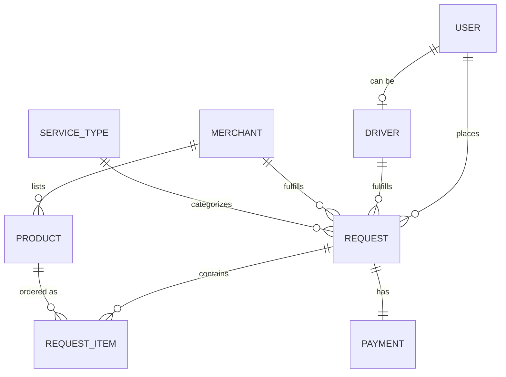

# KareebuPlus-Codex — Backend Architecture (v0.8)

## Overview

Core backend data model for the KareebuPlus-Codex super app: a customer-facing
app supporting ride-hailing, quick-commerce, and grocery delivery (with room
for more verticals later), a merchant side, a driver side, and admin
oversight — all on one shared backend. Target market: Uganda. Design
inspiration: Talabat, Careem.

**Status:** early draft, based on standard super-app patterns. Not yet
matched against the actual customer app or driver app (already built
separately) — refine once those are available to reference.

**Recommended stack: Supabase** (Postgres + PostGIS + Realtime). The schema
below is relational, PostGIS gives native geo-radius driver queries, and
Realtime subscriptions handle pushing new requests to driver apps, print
jobs to merchant devices, and match updates to customer apps — without
building any of that messaging infrastructure from scratch solo.

## Core design principle: unified service requests

Rather than building a separate system per vertical, every ride and every
order is a `request`: someone asks for something, the system matches it to a
driver, the driver fulfills it, payment settles. A `service_type` field
distinguishes what kind of request it is and drives which optional fields
apply. Adding a new vertical later means adding a service type, not building
a new system.

## Core entities

- **user** — any account: id, name, phone, role (customer / merchant staff / driver)
- **driver** — extends a user: vehicle_type, verification status, current_location (geography/point), availability, rating
- **merchant** — a store/restaurant/dark-store: id, name, category, location, status, application_status (pending/approved/rejected)
- **product** — items a merchant sells: id, merchant_id, name, price, availability
- **service_type** — config per vertical: id, name (ride / quick_commerce / grocery / ...), needs_merchant, needs_items, allowed_vehicle_types, dispatch_trigger (`immediate` / `on_ready`)
- **request** — the unifying order-or-trip record: id, customer_id, service_type_id, merchant_id (nullable), driver_id, status, origin, destination (pin coordinates, not a typed address), price, created_at
- **request_item** — line items on a request (used for commerce types, skipped for rides): request_id, product_id, quantity
- **payment** — settlement per request: id, request_id, total, driver_payout, merchant_payout, platform_fee, status (`held` / `paid_out` / `refunded`), held_at, paid_out_at
- **category** — taxonomy node: id, name, parent_category_id (nullable, for subcategories), sort_order
- **promotion** — a discount campaign: id, type (percent/flat), value, scope (site / category / merchant / product), scope_id, start_date, end_date, status
- **banner** — a promotional banner: id, image_url, link_target, placement, start_date, end_date, status
- **product_import_job** — a merchant's bulk upload attempt: id, merchant_id, file_name, status, rows_total, rows_succeeded, rows_failed, error_log, created_at
- **merchant_printer** — a store's registered print device: id, merchant_id, connection_type (LAN preferred; Bluetooth/USB discouraged — unreliable reconnection in practice), last_seen_at

*(diagram shows the core transactional model; category, promotion, banner, product_import_job, and merchant_printer are supporting/config entities, omitted above to keep this readable)*

## How each vertical maps onto this model

| Vertical | needs_merchant | needs_items | dispatch_trigger | Uses |
|---|---|---|---|---|
| Ride-hailing | No | No | immediate | origin, destination |
| Quick-commerce | Yes | Yes | on_ready | merchant_id, request_item[], drop-off pin |
| Grocery | Yes | Yes | on_ready | same as quick-commerce, typically longer prep time |
| Future vertical | Configurable | Configurable | Configurable | add a service_type row; reuse the same request shape |

## Order fulfillment & printing

Standard pattern used by Talabat, UberEats, and DoorDash for restaurant/store
fulfillment — a printer in-store, not a screen staff has to watch:

1. Order created → if `needs_merchant`, a print job fires immediately to the merchant's registered printer via Realtime, so staff can start prepping without opening the app
2. A low-cost Android tablet or basic PC in the store (the `merchant_printer` bridge device) receives the job and sends it to a thermal receipt printer over **LAN/WiFi** — not Bluetooth or USB, which other platforms have found unreliable for reconnection
3. Printer just needs to support **ESC/POS** (the universal thermal-printer protocol) — any generic printer works, not a specific expensive brand
4. Merchant fulfills the order, taps "ready" in the merchant app
5. `dispatch_trigger` fires based on service_type: `on_ready` for commerce orders (driver search starts now, not at order creation), `immediate` for rides (no prep step exists)
6. Driver picks up, matches the physical receipt to the order
7. Driver taps "picked up" → navigation SDK takes over (Google Maps Directions API as the safer default for Uganda; Mapbox as an alternative) to guide them to the drop-off pin

**Uganda-specific note:** formal street addresses are unreliable in many
neighborhoods — drop-off location should be a pin dropped on a map, not a
typed address field.

## Platform admin panel

Desktop-first — this is an internal tool for your team, not something
merchants or customers touch. Sidebar navigation, eight sections:

1. **Dashboard** — today's orders, revenue, active drivers, and a "needs attention" list (pending merchant/driver applications, open disputes) surfaced first
2. **Catalog** — categories & subcategories: create, edit, reorder, nest under a parent
3. **Merchants** — full list, review and approve/reject pending applications, view submitted documents, suspend/reactivate
4. **Drivers** — full list, review and approve/reject pending applications (documents, vehicle info), suspend/reactivate
5. **Promotions** — campaigns and banners, scoped to the whole site, a category, a merchant, or a single product
6. **Orders** — every request across the platform, filterable by status, entry point for refunds/disputes
7. **Payouts** — the payment ledger (held vs. paid-out), payout run history, the weekly→daily interval setting
8. **Settings** — service type configuration (the ride/quick-commerce/grocery setup, vehicle types, dispatch trigger)

## Merchant admin panel

Kept intentionally simple — built for shop owners, not developers. Designed
against known pain points in Talabat's own partner app (per merchant
reviews): no live refresh, unclear payment status on orders, no bulk actions
across outlets. This design fixes the first two directly.

**Screens:**
1. **Home** — today's orders, today's revenue, anything needing attention, at a glance
2. **Orders** — new / preparing / ready / history tabs; live push on new orders (no manual refresh); payment status shown as a badge on every order; accept/reject actions on the order card itself, no drill-in required; "ready" here is what fires driver dispatch
3. **Products** — catalog list, quick in-stock/out-of-stock toggle per item, add/edit, entry point to the CSV bulk import
4. **Earnings** — held vs. paid-out amounts, payout history (reflects the payment/payout design above)
5. **Store profile** — hours, an open/pause toggle (temporarily stop taking orders), location, category, registered printer device

## Matching & dispatch

1. Dispatch trigger fires — immediately on request creation for rides, on merchant "ready" for commerce orders (see Order fulfillment above)
2. Search for available drivers within a radius, filtered by the vehicle types the service_type allows
3. Broadcast the request to nearby candidates simultaneously — first to accept wins (faster than offering drivers one at a time)
4. If nobody accepts within ~15 seconds, widen the radius and retry; after a few rounds with no match, surface "no drivers available" rather than waiting indefinitely
5. On accept: driver status → busy, request status → `matched`, both apps notified in real time (Supabase Realtime)
6. Driver picks up → navigation to drop-off pin takes over

## API surface

Most reads/writes don't need a custom endpoint — they're direct, secured
table access via Supabase's auto-generated API, gated by Row Level Security
policies per role (a customer sees only their own requests, a driver only
what's offered to them, a merchant only their own store, admin sees
everything). Only operations with real side effects need an actual endpoint
(Supabase Edge Function):

| App | Endpoint | What it does |
|---|---|---|
| Customer | `create_request` | Creates the request; triggers dispatch immediately if the service type doesn't need a merchant |
| Customer | `cancel_request` | Cancels an active request, handles any cancellation fee |
| Merchant | `mark_order_ready` | Marks an order prepared; triggers dispatch for service types that need a merchant |
| Driver | `accept_request` | Claims an offered request (must be atomic — conditional update on driver_id being empty, so simultaneous accepts can't double-assign) |
| Driver | `decline_request` | Passes on an offer, moves to the next candidate |
| Driver | `update_request_status` | Marks picked up / in transit / delivered |
| Merchant | `import_products` | Parses an uploaded CSV, validates rows, returns a success/error report |
| Merchant | `accept_order` / `reject_order` | Confirms or declines a new order |
| Admin | `approve_merchant` / `reject_merchant` | Resolves a pending application |

## Payments & payouts

**Provider: Flutterwave** — BOU-licensed, supports MTN Mobile Money and
Airtel Money (which dominate Ugandan transactions) plus cards, and handles
both collections and payouts/transfers through one API. Pesapal and DPO are
the other established options in this market, worth comparing on fees before
committing. Routing money through a licensed aggregator isn't just
convenient — Uganda's National Payment Systems Act requires a Bank of Uganda
license to operate a payment service, so KareebuPlus can't legally hold and
move customer/merchant/driver funds itself without one.

Flow:
1. Customer pays via the aggregator (mobile money or card) at checkout
2. Funds collect into the platform's aggregator balance
3. `payment` row created with status `held`, split into driver_payout / merchant_payout / platform_fee
4. A scheduled payout job (interval is a config value, not hardcoded — start weekly, tighten to daily later) sums each merchant's and driver's held earnings since their last payout and triggers a transfer via the aggregator's payout API to their registered mobile money number or bank account
5. `payment.status` → `paid_out`

**Worth confirming with a lawyer closer to launch:** whether Flutterwave's
license fully covers this structure, or whether holding funds across many
merchants and drivers requires anything additional from BOU directly.

## Still ahead

1. Refund/dispute handling — how a refund unwinds a `held` payment before payout
2. Customer app screens — audit against the already-built app once shared
3. CSV import — exact validation rules and column-mapping UI
4. Dispatch tuning — radius/timeout values, ranking beyond "first to accept"
5. RLS policies — the actual per-table security rules
6. Print bridge app — the actual tablet/PC software that receives jobs and talks ESC/POS to the printer
